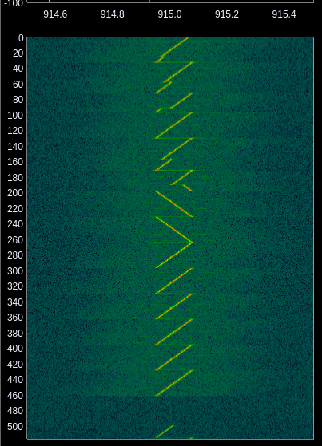
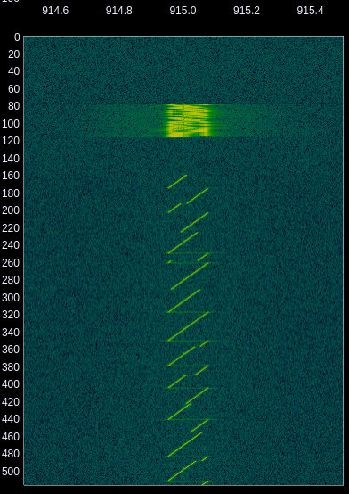
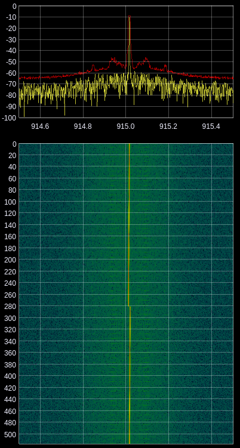
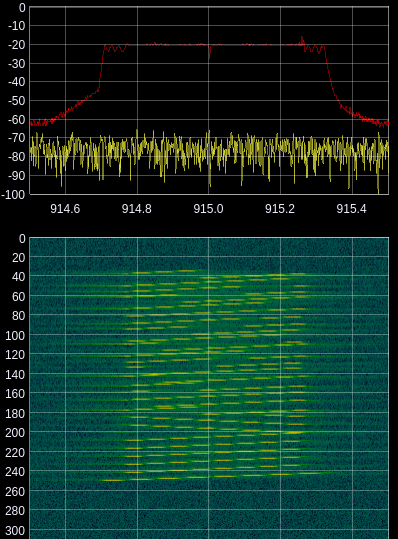

# arduino_lora_boilerplate
Simple skeleton to interface with a [Reyax RYLR896](http://reyax.com/products/rylr896/) Serial LoRa module

This project provides a starting place that works around two of the biggest
problems when using the RYLR module with Arduino.
1. Printing anything to the serial monitor for debugging will generate lots
of errors from the module not recognizing them as commands.
2. It isn't possible to upload a sketch without disconnecting the module
from the serial lines.


## Solving the serial problem
The boilerplate sketch provided `arduino_lora_boilerplate.ino` does the work of reading input from the module
and parsing out the different possible responses. This allows for suppressing
the nuisance errors caused by printing debug information out in your program.

This also provides a simple and transparent framework for working with the
module since input parsing is already being done. See below for tips on adding
different behaviors to the boilerplate code.

## Solving the flashing problem
In order to prevent the module from interfering with the flashing process,
the reset line has to be held low in the bootloader. Provided in this project
is a script that downloads optiboot, patches it, and builds boodloaders for
all arduino boards that optiboot supports. 

```bash
$ ./build_bootloader.sh
```

The bootloaders are copied into the ./bootloaders/ folder. Modify the script
`burn_bootloader.sh` to match your programmer and target setting.

```bash
# Modify the script first to change settings for your setup
$ ./burn_bootlaoder.sh
```

**Note:** Burning the bootloader requires another
Arduino to act as a programmer. See this guide for more information: 
[https://www.arduino.cc/en/Tutorial/BuiltInExamples/ArduinoISP](https://www.arduino.cc/en/Tutorial/BuiltInExamples/ArduinoISP)

*Example programmer for burning the modified bootloader:*  


# Wiring
Notes:
* This was designed for an Arduino Nano but should be compatible with other boards.
* The N/C pin and RESET on the Aduino board may be soldered together for convenience  


# Building on this boilerplate
The first thing to understand about this sketch is that it's not a well
polished library that abstracts all the details. Maybe that will come along
one day, but this repo is just me sharing some code that I wrote to get the
damn thing working :)

## Always keep in mind
The process_character() function needs to run *very frequently* since only one character
of input from the module is read each time it is called. Think of it like
having a watchdog timer!

## Reacting to incoming data
Add your code to the process_response() function under the RES_RCV case.
```c++
...
void process_response() {
  ...
  // Respond to an incoming message by sending "PONG", also toggle the LED
  case RES_RCV:
    Serial.print("AT+SEND=0,4,PONG\r\n");
    digitalWrite(LED_BUILTIN, !digitalRead(LED_BUILTIN));
    break;
  ...
}
...
```

## Sending something periodically
Add your code to the loop() function inside of an if statement that checks
millis()
```c++
...
unsigned long timer = 0;
void loop() {
  char next = Serial.read();
  process_character(next);
  
  // Add something like this:
  if (millis() > timer) {
    // Don't spend a long time here! 
    // The process_character() call above needs to run again as soon as possible
    do_something(); 
    timer = millis() + 5000; // Reschedule for 5 seconds later
  }
}
...
```

## Sending something in response to an interrupt
As always, keep your ISR as small as possible! A good idea would be to set a 
flag that lets you know something needs to be done. Then handle that flag with
an if statement in the loop() function.
```C++
...
void setup() {
  ...
  // Set up your interrupt
  attachInterrupt(digitalPinToInterrupt(pin), my_handler, RISING);
}

bool interrupt_flag = false;
void my_handler() {
  interrupt_flag = true;
}

void loop() {
  char next = Serial.read();
  process_character(next);
  // Add something like this
  if (interrupt_flag) {
    // Don't spend a long time here! 
    // The process_character() call above needs to run again as soon as possible
    do_something(); 
    interrupt_flag = false; // Clear the flag
  }
}
...
```
# Notes about AT+PARAMETER's
## Ranges and defaults

| Parameter | Min | Max | Default | Effect on bitrate |
| --------- | --- | --- | ------- | ----------------- |
| Spreading factor | 7 | 12 | 12 | O(n/2^n) |
| Bandwidth | 0 (7.8 kHz) | 9 (500 kHz) | 7 (125 kHz) | O(n) |
| Coding Rate | 1 | 4 | 1 | O(4/(4+n)) |
| Programmed Preamble | 4 | 25\* | 4 | O(1) |
| Frequency\*\* | 711.1 MHz | 1.024 GHz | 915.0 MHz| O(1) |

*\*Datasheet specifies max=7 but module will successfully configure up to 25*  
*\*\*Not set through the AT+PARAMETER command*

## Symbol Rate and number of symbols
The time it takes to send a LoRa packet is rediculously variable. Certain configurations can take on the order of seconds to send just a few bytes.

To calculate the time to send a packet, you need to know the nuber of symbols that will be sent, and the symbol rate.


## Spreading Factor
Maximum spreading factor 12:



The minimum spreading factor 7 has the fastest bit-rate:



## Bandwidth
Minimum bandwidth:



Maximum bandwidth:



## Coding Rate
Coding rate affects the number of forward error correction bits included in the data payload. Total bytes transmitted is 4/(4+CR) times the number of data bytes, where CR is set from 1 to 4.

## Programmed preamble
The preamble parameter affects the number of down-chirp symbols added at the beginning of a frame.

## Additional resources
* [https://docs.exploratory.engineering/lora/dr_sf/](https://docs.exploratory.engineering/lora/dr_sf/)
* [https://www.thethingsnetwork.org/article/how-spreading-factor-affects-lorawan-device-battery-life](https://www.thethingsnetwork.org/article/how-spreading-factor-affects-lorawan-device-battery-life)
* [https://www.youtube.com/playlist?list=PLmL13yqb6OxdeOi97EvI8QeO8o-PqeQ0g](https://www.youtube.com/playlist?list=PLmL13yqb6OxdeOi97EvI8QeO8o-PqeQ0g)
