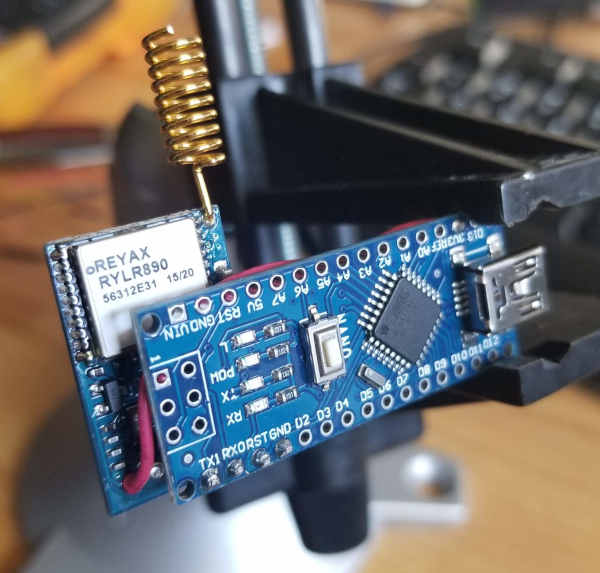
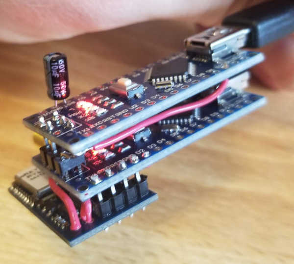
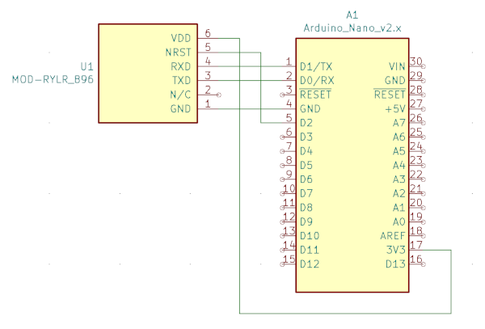

# arduino_lora_boilerplate
Simple skeleton to interface with a [Reyax RYLR896](http://reyax.com/products/rylr896/) Serial LoRa module

This project provides a starting place that works around two of the biggest
problems with using the RYLR module with Arduino.
1. Printing anything to the serial monitor for debugging will generate lots
of errors from the module not recognizing them as commands.
2. It isn't possible to upload a sketch without disconnecting the module
from the serial lines.



## Solving the serial problem
The boilerplate sketch provided does the work of reading input from the module
and parsing out the different possible responses. This allows for suppressing
the nuisance errors caused by printing debug information out in your program.

This also provides a simple and transparent framework for working with the
module since input parsing is already being done. See below for tips on adding
different behaviors to the boilerplate code.

## Solving the flashing problem
In order to prevent the module from interfering with the flashing process,
the reset line has to be held low in the bootloader. Provided in this project
is a script that downloads optiboot, patches it, and builds boodloaders for
all arduino boards that optiboot supports. 

```bash
$ ./build_bootloader.sh
```
The bootloaders are copied into the ./bootloaders/ folder. Pick the right one
for your board and copy it into your arduino environment. Replace the
destination path with one appropriate for your machine.

```bash
$ cp bootloaders/optiboot_atmega328.hex ~/.arduino15/packages/arduino/hardware/avr/1.8.3/bootloaders/optiboot
```

Unfortunately this requires burning the bootloader which requires another
Arduino to act as a programmer. See this guide for more information: 
[https://www.arduino.cc/en/Tutorial/BuiltInExamples/ArduinoISP](https://www.arduino.cc/en/Tutorial/BuiltInExamples/ArduinoISP)
Example Programmer:


# Wiring
Note this was designed for an Arduino Nano but should be compatible with other boards.



# Building on this boilerplate
The first thing to understand about this sketch is that it's not a well
polished library that abstracts all the details. Maybe that will come along
one day, but this repo is just me sharing some code that I wrote to get the
damn thing working :)

## Always keep in mind
The loop() function needs to run *very frequently* since only one character
of input from the module is read each time it is called. Think of it like
having a watchdog timer!

## Reacting to incoming data
Add your code to the process_response() function under the RES_RCV case.
```c++
// Respond to an incoming message by sending "PONG", also toggle the LED
case RES_RCV:
  Serial.print("AT+SEND=0,4,PONG\r\n");
  digitalWrite(LED_BUILTIN, !digitalRead(LED_BUILTIN));
  break;
```

## Sending something periodically
Add your code to the loop() function inside of an if statement that checks
millis()
```c++
unsigned long timer = 0;
void loop() {
  char next = Serial.read();
  process_character(next);
  
  // Add something like this:
  if (millis() > timer) {
    // Don't spend a long time here! 
    // The process_character() call above needs to run again as soon as possible
    do_something(); 
    timer = millis() + 5000; // Reschedule for 5 seconds later
  }
}
```

## Sending something in response to an interrupt
As always, keep your ISR as small as possible! A good idea would be to set a 
flag that lets you know something needs to be done. Then handle that flag with
an if statement in the loop() function.
```C++
void setup() {
  ...
  // Set up your interrupt
  attachInterrupt(digitalPinToInterrupt(pin), my_handler, RISING);
}

bool interrupt_flag = false;
void my_handler() {
  interrupt_flag = true;
}

void loop() {
  ...
  // Add something like this
  if (interrupt_flag) {
    // Don't spend a long time here! 
    // The process_character() call above needs to run again as soon as possible
    do_something(); 
    interrupt_flag = false; // Clear the flag
  }
}
```


